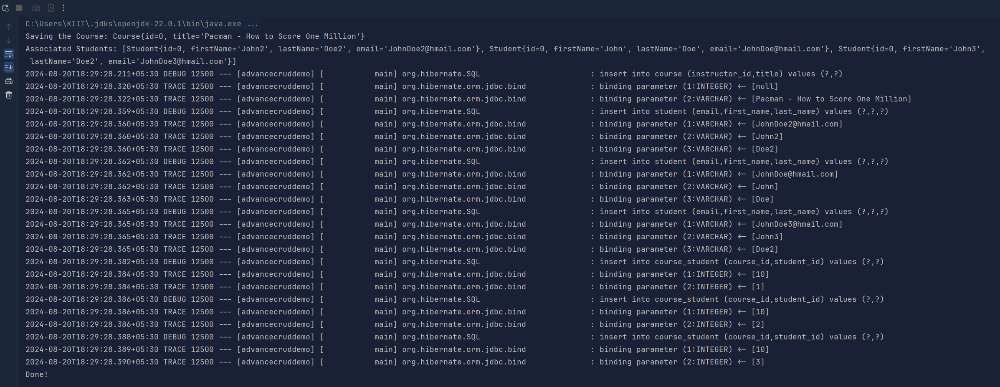

# Hibernate-JPA-One-to-Many

### SQL Script
~~~
DROP SCHEMA IF EXISTS `hb-03-one-to-many`;

CREATE SCHEMA `hb-03-one-to-many`;

use `hb-03-one-to-many`;

SET FOREIGN_KEY_CHECKS = 0;

DROP TABLE IF EXISTS `instructor_detail`;

CREATE TABLE `instructor_detail` (
  `id` int NOT NULL AUTO_INCREMENT,
  `youtube_channel` varchar(128) DEFAULT NULL,
  `hobby` varchar(45) DEFAULT NULL,
  PRIMARY KEY (`id`)
) ENGINE=InnoDB AUTO_INCREMENT=1 DEFAULT CHARSET=latin1;

DROP TABLE IF EXISTS `instructor`;

CREATE TABLE `instructor` (
  `id` int NOT NULL AUTO_INCREMENT,
  `first_name` varchar(45) DEFAULT NULL,
  `last_name` varchar(45) DEFAULT NULL,
  `email` varchar(45) DEFAULT NULL,
  `instructor_detail_id` int DEFAULT NULL,
  PRIMARY KEY (`id`),
  KEY `FK_DETAIL_idx` (`instructor_detail_id`),
  CONSTRAINT `FK_DETAIL` FOREIGN KEY (`instructor_detail_id`) 
  REFERENCES `instructor_detail` (`id`) ON DELETE NO ACTION ON UPDATE NO ACTION
) ENGINE=InnoDB AUTO_INCREMENT=1 DEFAULT CHARSET=latin1;

DROP TABLE IF EXISTS `course`;

CREATE TABLE `course` (
  `id` int NOT NULL AUTO_INCREMENT,
  `title` varchar(128) DEFAULT NULL,
  `instructor_id` int DEFAULT NULL,
  
  PRIMARY KEY (`id`),
  
  UNIQUE KEY `TITLE_UNIQUE` (`title`),
  
  KEY `FK_INSTRUCTOR_idx` (`instructor_id`),
  
  CONSTRAINT `FK_INSTRUCTOR` 
  FOREIGN KEY (`instructor_id`) 
  REFERENCES `instructor` (`id`) 
  
  ON DELETE NO ACTION ON UPDATE NO ACTION
) ENGINE=InnoDB AUTO_INCREMENT=10 DEFAULT CHARSET=latin1;

SET FOREIGN_KEY_CHECKS = 1;

drop table if exists `review`;

CREATE TABLE `review` (
	`id` int(11) NOT NULL AUTO_INCREMENT,
    `comment` varchar(256) DEFAULT NULL,
    `course_id` int(11) DEFAULT NULL,
    PRIMARY KEY(`id`),
    KEY `FK_COURSE_ID-idx` (`course_id`),
    CONSTRaINT `FK_COURSE` FOREIGN KEY (`course_id`)
    REFERENCES `course` (`id`)
    ON DELETE NO ACTION ON UPDATE NO ACTION
    ) ENGINE=InnoDB AUTO_INCREMENT=1;
~~~
### ER Diagram

### Some Extra Stuffs (How Adding of Insertion works behind the Scene)

~~~

TypedQuery<Student> query=entityManager.createQuery(
                "select s from Student s "+ "JOIN FETCH s.courses "+"where s.id=:data", Student.class
        );

        query.setParameter("data",theId);
~~~
